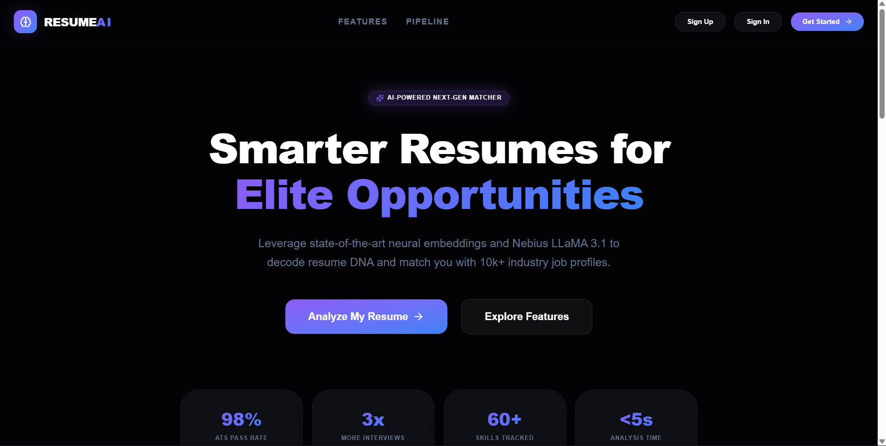
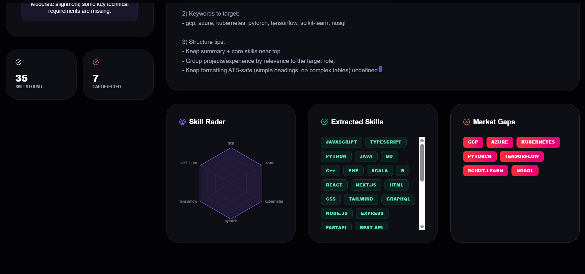
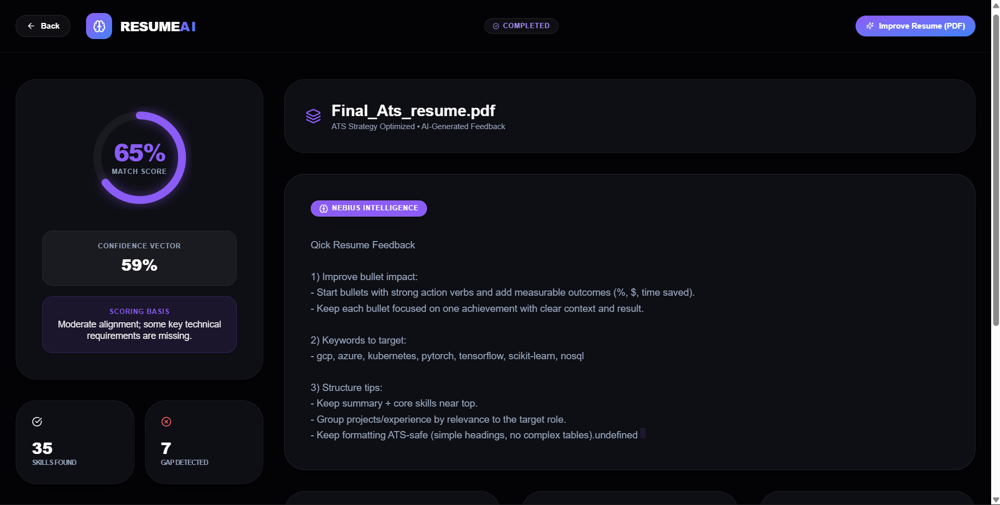
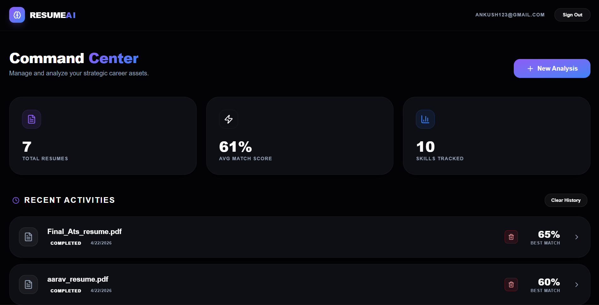
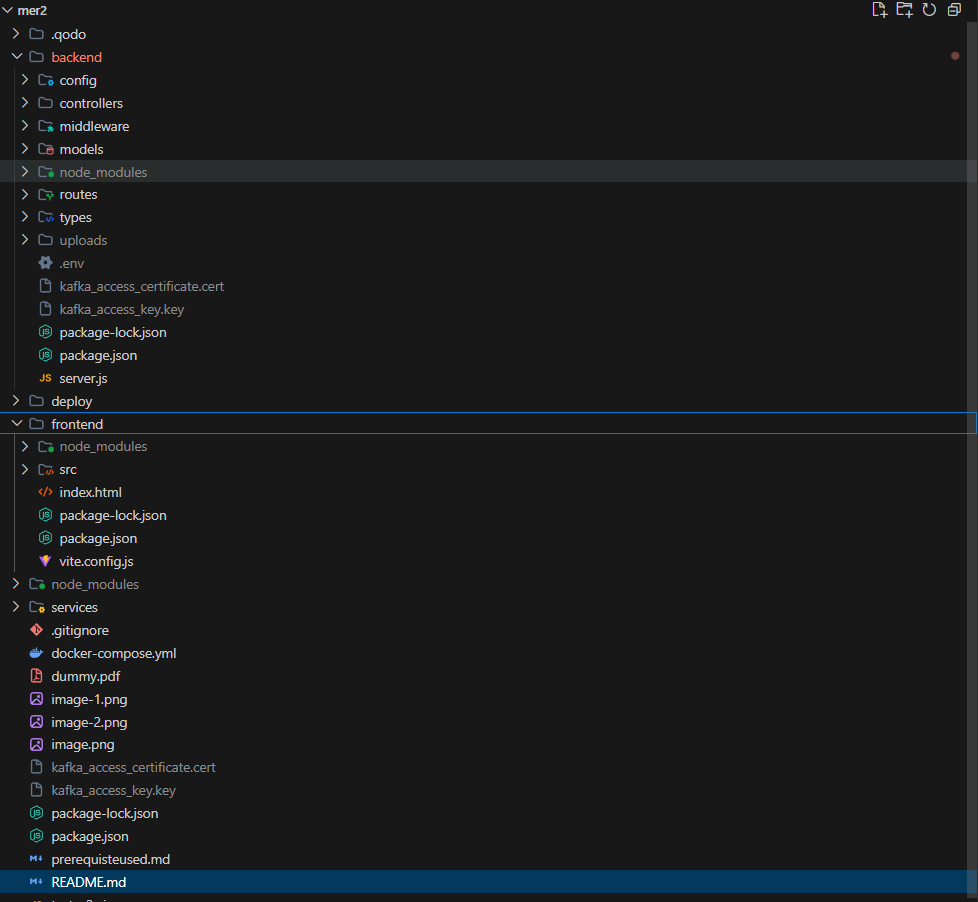

<div align="center">


```



 █████╗ ██╗     ██████╗ ███████╗███████╗██╗   ██╗███╗   ███╗███████╗
██╔══██╗██║     ██╔══██╗██╔════╝██╔════╝██║   ██║████╗ ████║██╔════╝
███████║██║     ██████╔╝█████╗  ███████╗██║   ██║██╔████╔██║█████╗  
██╔══██║██║     ██╔══██╗██╔══╝  ╚════██║██║   ██║██║╚██╔╝██║██╔══╝  
██║  ██║██║     ██║  ██║███████╗███████║╚██████╔╝██║ ╚═╝ ██║███████╗
╚═╝  ╚═╝╚═╝     ╚═╝  ╚═╝╚══════╝╚══════╝ ╚═════╝ ╚═╝     ╚═╝╚══════╝
```

### **AI Resume Scorer**

*An AI-powered resume analysis platform built on a TypeScript MERN stack with event-driven microservices*


<br/>

[](https://www.typescriptlang.org/)
[](https://react.dev/)
[](https://nodejs.org/)
[](https://www.mongodb.com/)
[](https://kafka.apache.org/)
[](https://redis.io/)

</div>

---

## ✦ What is AI Resume Scorer?

Ai resumer scorer is a full-stack, production-grade resume intelligence platform. Candidates upload resumes, match them against job descriptions, identify skill gaps, and track their analysis history — all through a polished, responsive dashboard powered by a streaming microservices pipeline.


---

## ⚡ Highlights

| | Feature |
|---|---|
| 🔄 | End-to-end resume analysis workflow — from upload to scored output |
| 🤖 | AI-assisted semantic matching with calibrated scoring logic |
| 🔐 | JWT-based authentication with fully protected API routes |
| 🗂️ | Resume history management — individual delete and bulk clear |
| 🧩 | Event-driven microservices: parser → embedder → skill extractor → matcher → feedback |
| 🎨 | Polished frontend UX with toast notifications and form validation |


---

## 🧱 Tech Stack

<table>
<tr>
<th>Layer</th>
<th>Technologies</th>
</tr>
<tr>
<td><strong>Frontend</strong></td>
<td>React 19, Vite, TypeScript, React Router, Axios, Tailwind CSS, Recharts, React Toastify</td>
</tr>
<tr>
<td><strong>Backend API</strong></td>
<td>Node.js, Express, TypeScript, Mongoose, JWT, bcryptjs, multer</td>
</tr>
<tr>
<td><strong>Data</strong></td>
<td>MongoDB, Redis</td>
</tr>
<tr>
<td><strong>Pipeline / Streaming</strong></td>
<td>Kafka (kafkajs) · parser · embedder · skill-extractor · matcher · feedback</td>
</tr>
<tr>
<td><strong>Dev Tools</strong></td>
<td>ts-node-dev, concurrently, ESLint</td>
</tr>
</table>

---

## 🗂️ Project Structure

```

```

---

## 🚀 Quick Start

### 1 · Install all dependencies

```bash
npm run install-all
```

### 2 · Configure environment files

Create `.env` files in `backend/` and any service that needs external credentials.  
See the [Environment Variables](#-environment-variables) section below.

### 3 · Start everything in development

```bash
npm run dev
```

This concurrently starts:

- ✅ Backend API
- ✅ Frontend app
- ✅ Parser service
- ✅ Embedder service
- ✅ Matcher service
- ✅ Skill-extractor service
- ✅ Feedback service

---

## 🛠️ Dev Commands

```bash
# Run individual services
npm run dev:backend        # API server only
npm run dev:frontend       # Vite dev server only
npm run dev:parser         # Parser microservice
npm run dev:embedder       # Embedder microservice
npm run dev:matcher        # Matcher microservice
npm run dev:skills         # Skill extractor microservice
npm run dev:feedback       # Feedback microservice
```

---

## 🔐 Environment Variables

Create `backend/.env` with the following:

| Variable | Description |
|---|---|
| `DATABASE_URL` | MongoDB connection URI |
| `JWT_SECRET` | Secret key for signing JWTs |
| `API_PORT` | API server port (default: `4000`) |
| `CORS_ORIGINS` | Comma-separated allowed frontend origins |
| `REDIS_URL` | Redis connection URI |
| `KAFKA_BROKERS` | Comma-separated Kafka broker addresses |
| `KAFKA_CA_PATH` | Path to Kafka CA certificate |
| `KAFKA_KEY_PATH` | Path to Kafka client private key |
| `KAFKA_CERT_PATH` | Path to Kafka client certificate |

---

## 🔌 API Overview

| Domain | Endpoints |
|---|---|
| **Auth** | Register, Login, User Profile |
| **Resumes** | Upload, List, Update, Delete, Clear History |
| **Jobs** | Create, List, Update, Delete |
| **Analytics** | Aggregated resume/job match insights & skill gap data |

---

## ✦ Core Features

### 🔐 Auth & Security
- User signup and login flows
- Password hashing via **bcrypt**
- JWT issuance and route protection middleware

### 📄 Resume & Job Management
- Full CRUD for resumes and job descriptions
- Bulk deletion of resume history per user

### 📊 Matching & Analytics
- Semantic similarity + skill overlap scoring
- Match confidence scores, skill gap analysis
- Dashboard visualizations via Recharts

### 🎨 Frontend Experience
- Animated, responsive page transitions
- Toast-based success/error feedback
- Client-side validation on login and signup forms

---

## 🚢 Deployment

Deployment assets live in `deploy/`:

- **`ecosystem.config.js`** — PM2 process management config
- **`nginx.conf`** — Reverse proxy configuration
- **`DEPLOYMENT.md`** — Step-by-step production deployment guide

Docker support is provided via `docker-compose.yml` for containerized local or cloud deployments.

---

## 📌 Project Status

> ✅ All baseline capstone requirements met

- [x] Structured MVC backend
- [x] Protected authentication flow
- [x] Full CRUD for all core resources
- [x] Frontend routing and API integration
- [x] Environment-driven configuration
- [x] Production deployment scaffolding

---

## 🚀 AI Resume Scorer & Enhancer: How It Works

This project is a high-performance MERN application integrated with an AI-driven microservice pipeline. It uses an event-driven architecture to transform sparse resumes into professional, one-page PDFs that match high-fidelity LaTeX templates.

### 🛰️ 1 · The Event-Driven Pipeline (Kafka)
We use **Apache Kafka** to ensure the system is scalable and asynchronous:
*   **Job Creation**: When you click "Improve Resume," the Backend sends a message to the `resume_to_enhance` topic.
*   **Processing**: The **Enhancer Service** picks up the job, processes it through the LLM, and creates the PDF.
*   **Completion**: Once done, the link appears in your dashboard instantly.

### 🧠 2 · The AI Enrichment Logic (Nebius AI)
We use the **Llama-3.3-70B** model to perform a "Surgical Upgrade" of the resume content:
*   **Smart Mapping**: If a project has 2 bullet points, the AI upgrades exactly those 2 bullets. If a section is empty, it generates 2-3 professional ones.
*   **Metric Injection**: The AI finds opportunities to add quantified achievements (e.g., "Increased revenue by 20%").

### 🛡️ 3 · The Quality Audit Layer
The system has a built-in "Editor-in-Chief" that runs before PDF creation:
*   **Density Check**: Scans output to ensure no headers are empty.
*   **Auto-Retry**: Triggers a rewrite if the initial AI pass is too "thin."

### 📄 4 · The LaTeX-Style PDF Engine
Built with a custom emulator in `pdf.js` that mirrors **Overleaf LaTeX** macros:
*   **One-Page Lockdown**: Uses "Pure-Flow" positioning logic to prevent text overlap.
*   **Typography**: Uses professional font pairings (Times-Bold, Italic) for a distinct academic/professional look.

---

<div align="center">

*Private project — for educational and portfolio use.*

</div>